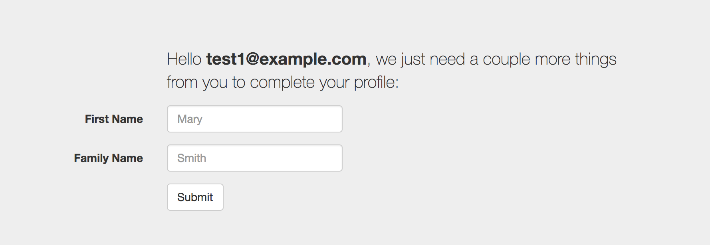
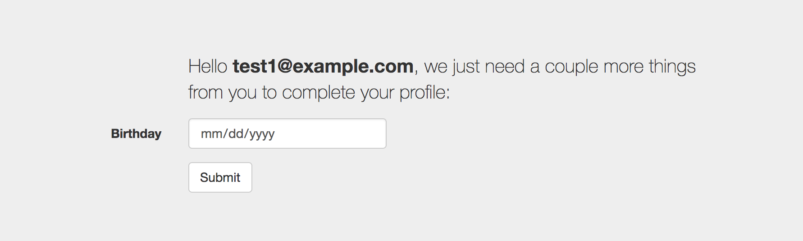

# Redirect Rule: Progressive Profiling

You can use [redirect rules](https://auth0.com/docs/rules/redirect) to collect additional information for a user's profile, otherwise known as [progressive profiling](https://auth0.com/docs/user-profile/progressive-profiling). There are often two types of information you want to collect:
* Core information that was missing during the actual sign-up (like first and last name)
* Additional first-party data that you'd like to collect progressively (like the user's birthday)

This sample shows how to collect both kinds of data. First, it will prompt the user for their first and last name (but only if they didn't sign up using a social provider that already provided it):



Second, it will prompt for the user's birthday, but only after the third login:



The user profile website is hosted using a [Webtask](https://webtask.io/) that you can easily modify and provision and use in your webtask tenant.

## Auth0 Setup

### Rules

In your Auth0 tenant, create the following [rules](https://auth0.com/docs/rules/current/redirect) in the below order:

1. [redirect-to-update-profile-website](./redirect-to-update-profile-website.js)
2. [continue-from-update-profile-website](./continue-from-update-profile-website.js)

Configure the following [Rule Settings](https://auth0.com/docs/rules/current#using-the-configuration-object):

| Key | Value |
| --- | --- |
| `TOKEN_ISSUER` | The issuer claim for the self-signed JWT that is generated by the [redirect-to-update-profile-website](./redirect-to-update-profile-website.js) rule and sent to the [update-profile-website](./update-profile-website.js) webtask website. (eg. `https://example.com`)|
| `TOKEN_AUDIENCE` | The audience claim for that JWT |
| `TOKEN_SECRET` | The secret used to sign the JWT using HS256 |
| `UPDATE_PROFILE_WEBSITE_URL`| The URL of the [update-profile-website](./update-profile-website.js) webtask website (eg. `https://wt-bob-example_com-0.sandbox.auth0-extend.com/update-profile-website`) |

## Webtask Setup

> Tenants created after *July 16, 2018* will not have access to the underlying Auth0 Webtask Sandbox via the Webtask CLI. Please contact Auth0 at sales@auth0.com to request access.

If you don't already have a [webtask.io](https://webtask.io) account, create one. Then in your webtask tenant, create the following webtasks, either via the [Webtask Editor](https://webtask.io/make) or the [CLI](https://webtask.io/docs/wt-cli):

### Update Profile Webpage

Create a webtask called `update-profile-website` using this [source code](./update-profile-website.js).

#### NPM Modules

Configure the webtask with these **NPM Modules**:

* `body-parser`
* `cookie-session`
* `csurf`
* `ejs`
* `express`
* `jsonwebtoken`
* `lodash`
* `moment`
* `webtask-tools`

#### Secrets

Configure the webtask with the following [secrets](https://webtask.io/docs/editor/secrets):

| Key | Value |
| --- | --- |
| `AUTH0_DOMAIN` | The domain of your Auth0 tenant |
| `TOKEN_ISSUER` | (Same value as the [Rules](#rules) section above) |
| `TOKEN_AUDIENCE` | (Same value as the [Rules](#rules) section above) |
| `TOKEN_SECRET` | (Same value as the [Rules](#rules) section above) |

## How It Works

The `redirect-to-update-profile-website` rule checks to see if the user profile is missing any required fields. If so, it will perform a redirect to the external **Update Profile Website**. In this sample the website is hosted as a webtask: `update-profile-website`. However, it could be hosted anywhere, like Heroku. When the redirect is performed, the required field names are passed via a self-signed [JWT](https://jwt.io).

> **NOTE**: If a user signs in with a Database Connection identity, then the `redirect-to-update-profile-website` rule will generate a prompt for first and last name. However, if they use a social connection (eg. Google) then chances are those fields will aleady exist in the identity provider attributes, so no prompt will be necessary.

The webtask renders a form that prompts the user for whatever fields were provided in the JWT. If the user provides the field values and they pass validation, the webtask renders a self-posting form with hidden fields, designed to POST the values back to the Auth0 `/continue` endpoint.

The `continue-from-update-profile-website` rule then picks up the POST request from the webtask and updates the user profile. All fields are stored in `user_metadata`. 

> **NOTE**: Using webtasks is just one way of implementing and deploying the Update Profile Webpage. Any HTTP server that provided the same behavior would suffice.

A completed `user_metadata` profile might look like this:

```json
{
  "given_name": "John",
  "family_name": "Smith",
  "birthdate": "1980-01-15"
}
```

## Security?

The handoff redirect from the `redirect-to-update-profile-website` rule to the `update-profile-website` webtask is made secure via the self-signed JWT. It prevents someone from calling the webtask directly to invoke a new rendering of the update form. However, it's possible that someone could replay the same exact request (URL) before the JWT token has expired. This is prevented by virtue of the redirect protocol's `state` parameter, which binds the Auth0 session to the website session. To complete the Auth0 authentication transaction, the website must redirect (or POST) back to the Auth0 `/continue` endpoint, passing the same `state` value. And since The `state` value can only be used once, it's impossible to replay the same transaction.

It should also be noted that in this sample a JWT is only required for the redirect from the `redirect-to-update-profile-website` rule to the `update-profile-website` webtask. The return trip is secured by virtue of the `state` parameter. And for added security and flexibility, the field values are returned to Auth0 via a POST vs. query parameters in a redirect (GET). There are cases where a JWT should be used on the return to Auth0. See this [docs section](https://auth0.com/docs/rules/current/redirect#how-to-securely-process-results) for more information.
